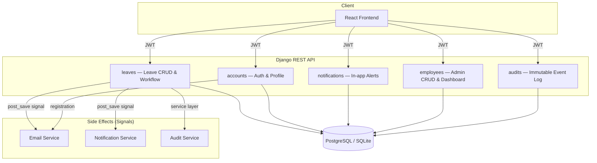

# Employee Leave Management System (ELMS)

Welcome — this repository contains the frontend and backend for a simple Employee Leave Management System (ELMS).

This single README explains how to run the frontend and backend locally in a friendly, practical way.

## Contents

- `backend/` — Django REST API and management commands
- `frontend/` — React + Vite single-page app

---

## Quick start (dev)

You'll typically run the backend API and frontend dev server at the same time during development.

1. Backend (Django)

   - Open a terminal and change to the backend folder:

     ```bash
     cd backend
     ```

   - Create and activate a Python virtual environment:

     ```bash
     python -m venv .venv

     # Windows
     venv\Scripts\activate

     # macOS / Linux
     # source .venv/bin/activate
     ```

   - Install dependencies:

     ```bash
     pip install -r requirements.txt
     ```

   - Copy the example environment file and edit values if needed:

     ```bash
     copy .env.example .env
     ```

     Key things to set in `.env`:
     - DB settings (`DB_ENGINE`, `DB_NAME`, `DB_USER`, `DB_PASSWORD`, `DB_HOST`, `DB_PORT`)
     - `FRONTEND_URL` (e.g. `http://localhost:5173`)

   - Run migrations and (optionally) seed demo data:

     ```bash
     python manage.py migrate
     python manage.py seed   # optional: populates demo users and leaves
     ```


     
## Creating a Super Admin

To create a super admin user, run the Django management command from the backend
directory:

```bash
cd ../backend
python manage.py createsuperuser
```

Follow the prompts to enter:
- **Email** — unique email address
- **First Name** — first name
- **Last Name** — last name
- **Employee ID** — unique employee identifier
- **Password** — secure password

The super admin user can then log in to the frontend at `http://localhost:8080`
with their email and password, and will have access to all admin features including
employee management, leave approvals, and audit logs.

   - Start the Django dev server:

     ```bash
     python manage.py runserver
     ```

   - The API will be available at `http://127.0.0.1:8000/api/` by default.

2. Frontend (React + Vite)

   - In a second terminal, change to the frontend folder:

     ```bash
     cd frontend
     ```

   - Install Node dependencies (npm shown; use `pnpm` or `yarn` if preferred):

     ```bash
     npm install
     ```

   - Optional: create a `.env` file to point the frontend at your API. The app defaults to `http://127.0.0.1:8000` if you don't set this.

     ```env
     VITE_API_BASE_URL=http://127.0.0.1:8000
     ```

   - Start the dev server:

     ```bash
     npm run dev
     ```

   - The frontend runs on Vite's default (usually `http://localhost:5173`). Open that in your browser.

## Notes & tips

- The frontend reads `VITE_API_BASE_URL` at build + dev time. If you are running the backend on `127.0.0.1:8000` you don't need to change anything.
- If using Docker Compose for Postgres, run it from the project root and ensure your `.env` matches the compose configuration.
- The backend includes useful management commands such as `seed` for demo data and `createsuperuser` for admin access.
- OpenAPI docs are available at `/api/docs/` when the server is running.

---


# ELMS — Architecture & Design Decisions

**Employee Leave Management System (LeaveDesk)** — a full-stack application for employees to request time off and for HR administrators to review, approve, or reject those requests.

This document explains *why* the system is structured the way it is, not just *what* it does. It is intended for reviewers evaluating code quality, system design, and problem-solving approach.

---

## 1. System Overview

| Layer | Technology | Role |
|-------|------------|------|
| Frontend | React 19, TypeScript, Vite, React Router | Employee & admin UI |
| Backend | Django 5, Django REST Framework | REST API, business rules, auth |
| Database | PostgreSQL (prod) / SQLite (local dev) | Persistent storage |
| Auth | SimpleJWT (access + refresh, blacklisting) | Stateless API authentication |
| Email | Django mail (SMTP or console backend) | Verification codes & leave alerts |

The frontend and backend are **decoupled**: the React app talks to the API over HTTP with JWT bearer tokens. This allows independent deployment (e.g. Netlify frontend + hosted Django API) and clear contract boundaries via OpenAPI at `/api/docs/`.

---

## 2. High-Level Architecture



---

## 3. Backend Design

### 3.1 App-per-domain layout

The backend follows Django’s **app-per-domain** pattern rather than a monolithic `views.py`:

| App | Responsibility |
|-----|----------------|
| `accounts` | User model, JWT auth, profile, email verification |
| `leaves` | Leave requests, validation, approve/reject workflow |
| `notifications` | In-app notifications (read/unread, list) |
| `employees` | Admin employee management, dashboard stats |
| `audits` | Append-only audit trail for compliance |

**Why:** Each app owns its models, serializers, URLs, and tests. Cross-cutting behaviour (email, notifications) is triggered from **signals** or called from **service functions**, keeping views thin.

### 3.2 Layered request handling

```
HTTP Request → View/ViewSet → Serializer (validation) → Service (business rules) → Model → DB
                                    ↓
                              Signals → Email / Notifications / Audit
```

- **Serializers** validate input/output shapes and enforce field-level rules.
- **Services** (`approve_leave_request`, `verify_email_code`) hold business logic that must not be duplicated across views and admin actions.
- **Signals** react to model changes for side effects (email + in-app notification on leave status change) without coupling the core workflow to delivery mechanisms.

**Why:** Separating “change leave status” from “notify employee” makes the approve/reject path testable in isolation and allows adding channels (SMS, push) later without rewriting views.

### 3.3 Authentication & email verification

| Decision | Rationale |
|----------|-----------|
| Email as `USERNAME_FIELD` | Natural identifier for employees; avoids username proliferation |
| JWT with refresh rotation + blacklist | Stateless API suitable for SPA; logout invalidates refresh tokens |
| `email_verified` gate on login | Prevents unverified self-registrations from accessing the system |
| 6-digit OTP, 15-minute TTL | Simple UX (OTP input on frontend); short-lived codes limit abuse |
| Admin-created users auto-verified | HR-provisioned accounts are trusted; no extra verification step |
| Resend endpoint with generic message for unknown emails | Avoids email enumeration |

Registration flow: **Register → email with code → verify → login**. Login is blocked until `email_verified=True`.

### 3.4 Leave workflow

Leave requests start as **Pending**. Only pending requests can be edited or deleted by the employee.

Admin actions use dedicated endpoints (`/approve/`, `/reject/`) rather than generic PATCH on `status`:

- **Explicit intent** in the API contract
- **Validation in one place** (overlap checks, self-approval prevention, required rejection comment)
- **Audit entries** created consistently via service layer

On approve/reject, two notification channels fire:

1. **Email** — `send_leave_status_email()` with HTML + plain-text templates
2. **In-app** — `Notification` record for the bell dropdown in the UI

Both are triggered from a single `post_save` signal on `LeaveRequest`, keeping the admin view unaware of delivery details.

### 3.5 Notifications vs audit trail

These solve different problems and are intentionally separate:

| Feature | Audience | Mutable | Purpose |
|---------|----------|---------|---------|
| `Notification` | Employee (and future roles) | Yes (read/unread) | Actionable UI alerts |
| `AuditTrail` | Admin only | No (append-only) | Compliance & investigation |

**Why not one table:** Mixing user-facing alerts with admin audit logs would complicate permissions, retention policies, and UI queries.

### 3.6 Email delivery

Emails are sent **synchronously** in the request thread via Django’s `send_mail`. For this scale, that is acceptable:

- Simpler ops (no Celery/Redis required for the assignment scope)
- Failures surface immediately in logs
- Dev uses `console` backend; production uses SMTP via environment variables

A future improvement would be an async queue (Celery + Redis) for retries and non-blocking approve/reject responses.

---

## 4. Frontend Design

### 4.1 Structure

```
src/app/
├── api/          # Axios client, domain API modules, shared types
├── context/      # AuthProvider (session bootstrap via /profile/)
├── layouts/      # App shell, sidebar, topbar (notifications)
├── pages/        # Route-level screens (employee / admin / auth)
├── routes/       # ProtectedRoute, RoleRoute guards
└── validations/  # Zod schemas mirroring backend rules
```

**Why:** API types mirror the Django serializers exactly (`types.ts`), reducing integration drift. One axios client handles JWT attach, refresh-on-401, and global error toasts.

### 4.2 Auth UX

- Register redirects to `/verify-email` with email pre-filled
- OTP component (`input-otp`) for 6-digit code entry
- Login surfaces a clear message and link when email is unverified
- Role-based routing sends `ADMIN` → admin dashboard, `EMPLOYEE` → employee workspace

### 4.3 Notifications UI

The topbar bell:

- Polls unread count every 30 seconds
- Opens a popover list with mark-read and mark-all-read
- Navigates employees to leave history on click

Polling was chosen over WebSockets to keep infrastructure simple; React Query could replace manual polling if real-time becomes a requirement.

---

## 5. Key Design Trade-offs

| Choice | Benefit | Cost |
|--------|---------|------|
| Django monolith API | Fast to build, strong ORM, built-in admin | Less ideal for extreme microservice scale |
| JWT in localStorage | Simple SPA integration | XSS risk — mitigated by short-lived access tokens |
| Signals for notifications | DRY side effects | Harder to trace than explicit calls in some debug scenarios |
| SQLite for local dev | Zero setup | Differs slightly from prod PostgreSQL |
| Synchronous email | No extra infrastructure | Approve/reject waits on SMTP latency |

---

## 6. Security Summary

- Password validators (Django defaults)
- Rate limiting (DRF throttling: 100/h anon, 1000/h authenticated)
- CORS restricted to configured origins
- Role permissions (`IsAdmin`, `IsEmployee`) on sensitive endpoints
- Refresh token blacklisting on logout
- Email verification before employee login
- Rejection requires admin comment (accountability)

---

## 7. Testing Strategy

Backend tests use **in-memory SQLite** and **locmem email backend** (configured in `settings.py` when `test` in argv).

Coverage includes:

- Auth (register, verify, login blocked until verified)
- Leave approve/reject (including email outbox assertion)
- Notification API (list, unread count, mark read)

Run: `python manage.py test`

---

## 8. Database Seeding

Demo data for local development and demos:

```bash
cd backend
python manage.py migrate
python manage.py seed
```

Options:

| Flag | Description |
|------|-------------|
| `--flush` | Remove previously seeded records before inserting |
| `--password` | Override default demo password |

Default demo password: `SecurePass123!`

See `seed` command output for created account emails.

---

## 9. Environment Setup Checklist

1. Copy `backend/.env.example` → `backend/.env`
2. Run `python manage.py migrate` (**required** after pulling schema changes)
3. Run `python manage.py seed` (optional demo data)
4. Start API: `python manage.py runserver`
5. Start frontend with `VITE_API_BASE_URL=http://127.0.0.1:8000`

For real emails, set `EMAIL_BACKEND=django.core.mail.backends.smtp.EmailBackend` and SMTP credentials in `.env`.

---

## 10. Problem-Solving Notes (Notifications & Verification Feature)

**Problem:** Employees needed verified accounts and timely feedback when leave is decided.

**Approach:**

1. Identified existing leave email infrastructure and extended it rather than replacing it
2. Added a dedicated `notifications` app instead of overloading `AuditTrail`
3. Used the same `post_save` hook so email and in-app alerts stay in sync
4. Frontend integrated via a single API module and topbar component, matching existing axios patterns
5. Migration `0003_verify_existing_users` ensures existing deployments are not locked out after adding `email_verified`

This incremental extension preserved existing behaviour while adding the new requirements with minimal blast radius.
